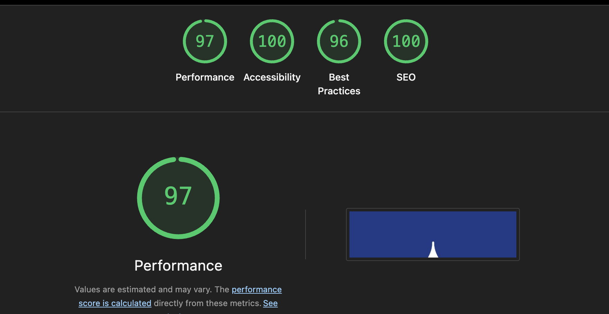

# Centerstate Plumbing & Heating LLC — Business Website & CMS

## Overview
This project is a landing page with a basic CMS built for a small business.
The admin has control over the content of the page from a dashboard.

## Live Site
https://www.centerstateplumbingnj.com

## Tech Stack
Next.js
Tailwind
Supabase

## Features
### Public Site
Landing page features a hero with a large logo and CTA with visible buttons to link to a contact form or call.
Scrolling down, the services section comes into view. This displays the various services offered by the business.
The next section is testimonials. Reviews are displayed here.
The pricing area displays information about different service prices.
An about section follows with information about the business.
The contact form allows visitors to submit their information via a form.
There is a service location area to allow visitors to see the range of availability from the business.
Finally in the footer the name of the business and the owners license information are displayed.


### Admin CMS
The admin pages begin with a login screen that includes a password recovery link.
There is a top navigation bar that allows the user to select which component to update and a page displaying the leads from the contact form on the public page.
Each component is editable from the admin.

## Architecture Notes
I used Next.js to build the entire site.
Supabase was used as the database and for validation and routes.
I used Supabase calls rather than API routes because this is a single page site. I felt that this kept the workflow cleaner and Next.js has plenty of tools including navigation and router. React hooks rounded out the logic with useState and useEffect.
Tailwind helped streamline the styling of the site. 

## Local Setup

### Prerequisites
- Node.js installed
- A Supabase account — create a project and grab your URL and anon key

### Environment Variables
Create a `.env.local` file in the root of the project:
```
NEXT_PUBLIC_SUPABASE_URL=your_supabase_url
NEXT_PUBLIC_SUPABASE_ANON_KEY=your_supabase_anon_key
```

### Install & Run
npm install
npm run dev

## Lighthouse Scores


## Portfolio Notes
This was the first project that I used Next.js, Tailwind and Supabase.
I had to learn how to setup the database and use auth from Supabase.
I enjoyed learning the Next.js framework and using more React than I ever have before.
Styling is my weakest skill, I focus more on the architecture of my programs, so learning Tailwind syntax helped me style this site. That being said, the styling of the page could use a designer to add some input.